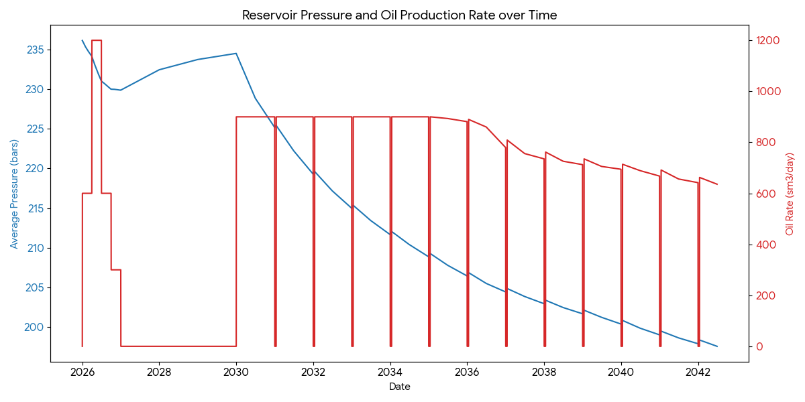
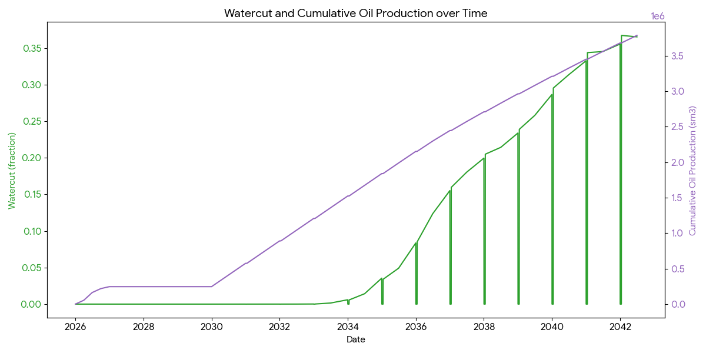

# Reservoir Analysis: Natural Depletion Case

This project provides a comprehensive analysis of a reservoir's performance under a **Natural Depletion** drive mechanism. The study spans from 2026 to mid 2042, evaluating pressure decline, production rates, and overall recovery efficiency.

## 1. Executive Summary
The reservoir demonstrates a significant recovery efficiency under natural depletion. Starting with an initial pressure of approximately **236.16 bars**, the field produces a total of **3,786.32 sm³** of oil, resulting in a recovery factor of **16.14%**.

## 2. Key Reservoir Metrics
| Parameter | Value |
| :--- | :--- |
| **Initial Reservoir Pressure** | 236.16 bars |
| **Final Reservoir Pressure** | 197.58 bars |
| **Original Oil In Place (OOIP)** | 23,452 sm³ |
| **Cumulative Oil Production (Np)** | 3,786.32 sm³ |
| **Final Recovery Factor (RF)** | **16.14%** |

## 3. Data Interpretation

### Pressure & Production Rate Trends
As oil is extracted without active water injection, the reservoir pressure declines steadily. 
- **Pressure Drop:** The pressure decreases by roughly **38.5 bars** over the 15-year production life.
- **Oil Rate:** The production rate starts at **600 sm³/day**, showing fluctuations as the field is managed, eventually declining as the reservoir energy is depleted.

### Watercut and Cumulative Production
- **Watercut:** The watercut remains very low for the majority of the field life, indicating a strong oil-productive window before significant water breakthrough. By the end of the period, watercut reaches approximately **0.24 (24%)**.
- **Cumulative Production:** The "Oil Total" curve shows a steady upward trajectory, reaching the final cumulative value of **3,786.32 sm³**.

## 4. Visual Analysis

### Pressure and Oil Rate Trend
This plot illustrates the relationship between the depletion of reservoir pressure and the daily oil production rates.

### Watercut and Cumulative Recovery
This plot tracks the efficiency of oil recovery ($N_p$) against the rising watercut.

## 5. File Structure
All raw data and generated assets are located in the `Data/` and `Figures/` directory.

---
*Note: This analysis assumes a natural depletion drive where no external water injection is utilized to maintain pressure.*
