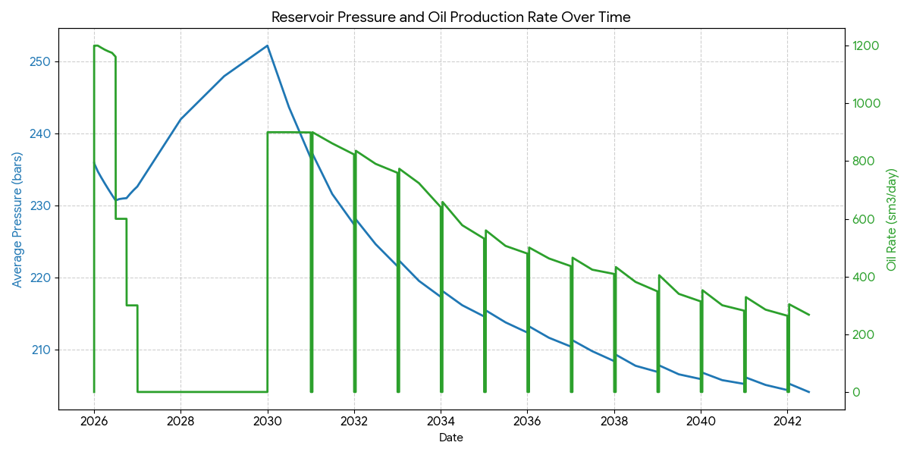
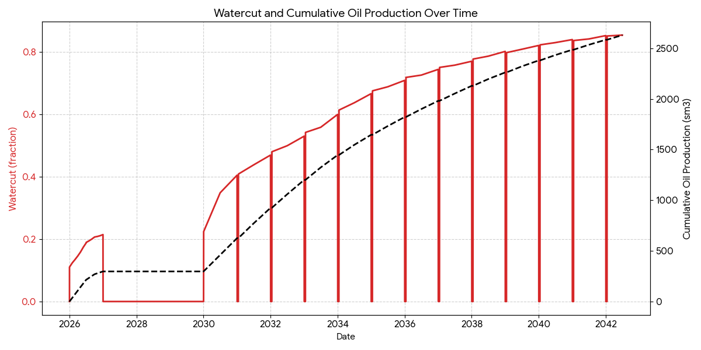

# Reservoir Analysis: Waterflood Performance Case

This repository contains the performance analysis for a reservoir operating under a **Waterflood** drive mechanism. The study evaluates the reservoir's pressure maintenance and production efficiency from 2026 through 2041.

## 1. Executive Summary
Based on the simulation data, the reservoir demonstrates a steady recovery profile supported by active water injection. By injecting water to displace oil, the project has recovered **26.43%** of the Original Oil In Place (OOIP) over a 15-year period. The injection strategy has helped mitigate pressure decline, maintaining the reservoir at **204.17 bars** at the end of the simulation.

## 2. Key Reservoir Metrics
The following metrics were derived from the `Recovery Factor Calculation.csv`:

| Parameter | Value |
| :--- | :--- |
| **Initial Reservoir Pressure ($P_i$)** | 235.93 bars |
| **Final Reservoir Pressure ($P_f$)** | 204.17 bars |
| **Original Oil In Place (OOIP)** | 9,951,000 sm³ |
| **Cumulative Oil Production ($N_p$)** | 2,629,626 sm³ |
| **Final Recovery Factor (RF)** | **26.43%** |

## 3. Data Interpretation

### Pressure & Injection Strategy

* **Pressure Maintenance:** The reservoir pressure declined by ~31.8 bars. While the pressure dropped, the decline was slowed by a constant water injection rate of **1,000 sm³/day**.
* **Production Rate:** The oil rate began at **1,200 sm³/day** but gradually declined to approximately **350 sm³/day**. This decline is a result of the combined effects of pressure depletion and increasing water saturation in the reservoir.

### Watercut Evolution

* **Early Breakthrough:** Unlike natural depletion, watercut began to rise early in the project life, which is expected in a waterflood scenario as the injected water reaches the production wells.
* **Final State:** At the end of the simulation, the watercut rises to approximately **80%**. This indicates a high sweep efficiency where a significant portion of the produced fluid is the injected water, signaling that the project is reaching its mature stage.

## 4. Visual Analysis

### Pressure and Oil Rate Trend
This plot illustrates the relationship between the reservoir pressure maintenance via injection and the resulting daily oil production rates.

### Watercut and Cumulative Recovery
This plot tracks the efficiency of oil recovery ($N_p$) against the rising watercut, showing the transition from oil-dominant to water-dominant production.

## 5. File Directory
All raw data and generated assets are located in the `data/` directory:
* `data/waterflood_analysis.xlsx - Waterflood Data.csv`: Daily time-series of pressure, rates, and totals.
* `data/waterflood_analysis.xlsx - Recovery Factor Calculation.csv`: Final RF analysis and OOIP assumptions.
* `data/reservoir_pressure_oil_rate.png`: Visualized pressure-production relationship.
* `data/watercut_cumulative_oil.png`: Visualized watercut-recovery relationship.

---
*Note: This case study specifically models **Waterflooding**. A continuous injection of 1,000 sm³/day was utilized to support reservoir energy and sweep oil.*
